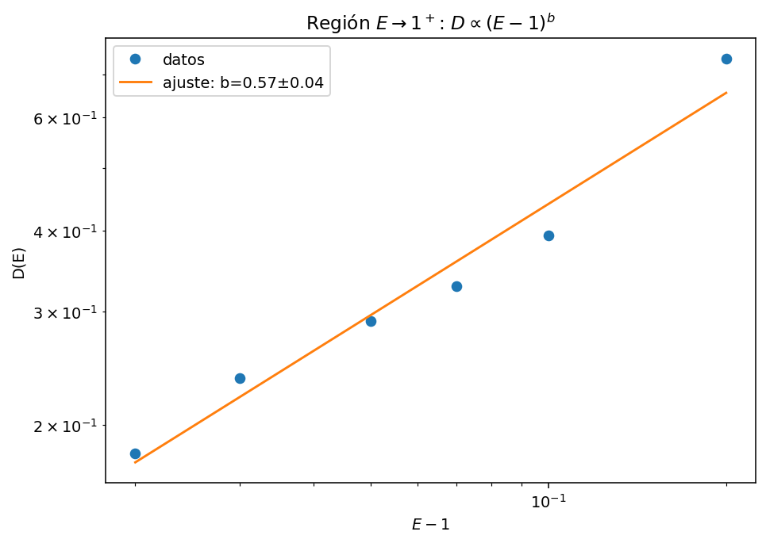
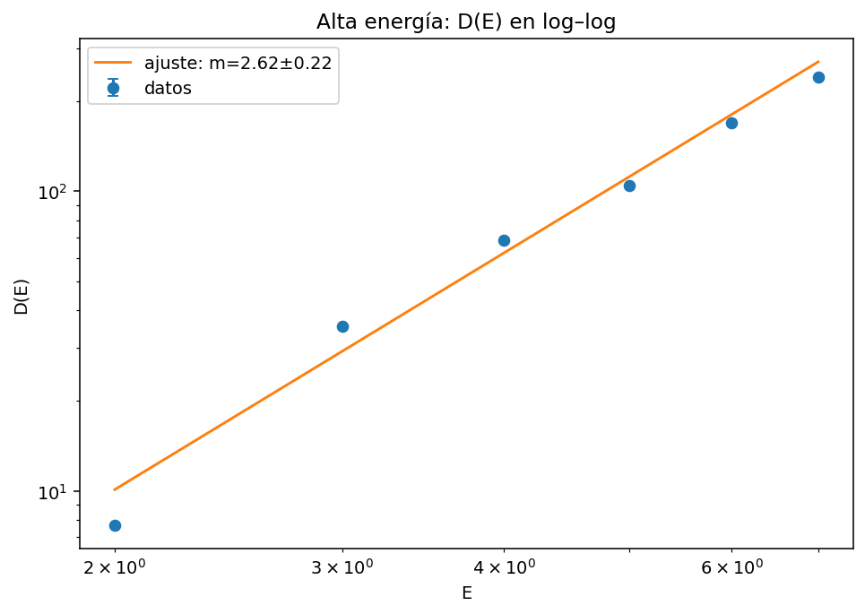
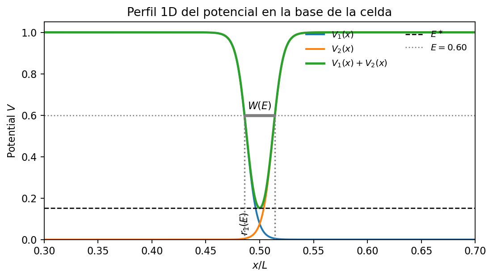

# Soft Lorentz Gas – Diffusion Simulations  
### Proyecto de Mecánica Estadística Avanzada (PUC)

Este repositorio contiene el código, figuras y notebooks utilizados para estudiar el comportamiento difusivo en un **Soft Lorentz Gas** bidimensional con potencial suavizado tipo Fermi.  
El núcleo del proyecto es el archivo:

- `src/simulate_soft_lorentz_diffusion_fixed.py`

donde se implementa la dinámica de partículas, el cálculo del **Mean Squared Displacement (MSD)** y la estimación del **coeficiente de difusión** \(D(E)\).

---

## 🧠 Idea general del código

El código simula un conjunto de partículas puntuales que se mueven en un potencial periódico generado por una **red triangular** de “discos suaves”.  
Para una energía total \(E\), las partículas obedecen la dinámica clásica:

- \\( \dot{\mathbf r} = \mathbf v \\)
- \\( \dot{\mathbf v} = \mathbf F(\mathbf r) = -\nabla V(\mathbf r) \\)

donde el potencial total es una suma de potenciales de tipo Fermi centrados en cada punto de la red.

A partir de las trayectorias se calcula:

\[
\text{MSD}(t) = \big\langle \lvert \mathbf r(t) - \mathbf r(0) \rvert^2 \big\rangle,
\]

y en régimen difusivo se ajusta la ley:

\[
\text{MSD}(t) \approx 4 D\, t,
\]

para obtener el coeficiente de difusión efectivo \(D\).

---

## 📓 Notebooks y figuras

- `notebooks/Resultados_finales.ipynb`:
  - Contiene ejemplos de corridas, gráficas de MSD(t), ajustes lineales y la curva D(E).  
  - Sirve como cuaderno de trabajo donde se documentan los parámetros utilizados y se guardan las figuras finales.
## 📊 Resultados principales

### 1. Meseta difusiva (ambos regímenes)

  
   
  <em>MSD/(4t) mostrando regiones cercanas al umbral y altas energías.</em>

### 2. Región cercana al umbral \(E \to 1^{+}\)

  
   
  <em>Ajuste en escala log–log: \(D \propto (E - 1)^{b}\).</em>

### 3. Alta energía – dependencia \(D(E)\)

  
   
  <em>Ajuste lineal en log–log para el régimen de energías grandes.</em>

---

## 📈 MSD detallado en cada régimen

### MSD vs t (región \(E \to 1^{+}\))

  
   
  <em>Comportamiento lineal del MSD en la cola temporal para energías cercanas al umbral.</em>

### MSD vs t (alta energía)

  
   
  <em>Comportamiento lineal bien definido en la región difusiva para energías grandes.</em>

---

## 🧭 Geometría del sistema

### Campo de potencial en la celda unitaria

  
   
  <em>Mapa del potencial suavizado tipo Fermi en la red triangular.</em>

### Perfil 1D del potencial en la base de la celda

  
   
  <em>Visualización del mínimo del canal y del ancho efectivo accesible para distintas energías.</em>

---

## 📝 Resumen

Este repositorio reúne las herramientas necesarias para simular y analizar el comportamiento difusivo en el **Soft Lorentz Gas** mediante dinámica clásica en un potencial periódico suavizado.

Para utilizar el código y recrear los resultados del proyecto, se recomienda descargar y ejecutar los siguientes archivos de Python del repositorio:

- `src/simulate_soft_lorentz_diffusion_fixed.py`  
- `notebooks/Resultados_finales.ipynb`  
- (Opcional) cualquier script auxiliar adicional dentro de `src/` que se agregue más adelante

El archivo `simulate_soft_lorentz_diffusion_fixed.py` contiene las funciones esenciales del modelo:

- Definición de la red triangular y sus vectores de base  
- Implementación del potencial suave tipo Fermi y su fuerza asociada  
- Manejo de condiciones periódicas reales mediante “wrapping” y acumulación de desplazamientos de red  
- Integración temporal con el esquema de Velocity Verlet  
- Cálculo del **Mean Squared Displacement (MSD)** y estimación del coeficiente de difusión efectivo \(D(E)\)

El notebook `Resultados_finales.ipynb` muestra cómo:

- Ejecutar las simulaciones para distintos valores de energía  
- Graficar MSD vs. tiempo  
- Ajustar el régimen difusivo para extraer \(D\)  
- Construir la curva \(D(E)\) y comparar tendencias con la literatura

---

### 🔬 Extensibilidad del código

El diseño modular del programa permite usar este repositorio como **base para estudiar otros sistemas**.  
En particular, es posible:

- Cambiar el potencial (por ejemplo, otros perfiles suaves o duros)  
- Modificar la geometría de la red (cuadrada, hexagonal, etc.) alterando los vectores `a1` y `a2`  
- Incorporar nuevos términos en la dinámica (campos externos, masas distintas, etc.)

De este modo, quien descargue los archivos de Python puede reutilizar la estructura general del código para explorar **modelos de difusión y transporte en otros medios periódicos**, sin tener que reescribir desde cero el framework numérico.

---

## 👥 Autores

- **Carlos Alberto Meza Morales** – Pontificia Universidad Católica de Chile  
- **Jesús David Muñoz Muñoz** – Pontificia Universidad Católica de Chile  

Proyecto desarrollado en el contexto del curso **Mecánica Estadística Avanzada (FIM8451-1)**.

---

## 📜 Licencia

El código se distribuye bajo licencia MIT (o la que se defina en el archivo `LICENSE`).  
Puedes usarlo, modificarlo y distribuirlo citando adecuadamente este repositorio.
